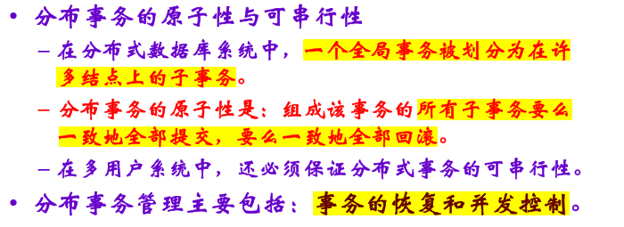

- [一、数据库的基础理论](#一数据库的基础理论)
  - [（一）认识数据库](#一认识数据库)
    - [1、数据库基础概念](#1数据库基础概念)
    - [2、数据管理技术的发展](#2数据管理技术的发展)
  - [（二）数据库系统的组成与特点](#二数据库系统的组成与特点)
    - [1、数据库系统的组成](#1数据库系统的组成)
    - [2、数据库系统的特点（简略）](#2数据库系统的特点简略)
  - [（三）数据库模型](#三数据库模型)
    - [1、模型层次](#1模型层次)
    - [2、概念模型](#2概念模型)
      - [概念模型概念](#概念模型概念)
      - [表示方法](#表示方法)
    - [3、数据模型](#3数据模型)
      - [三要素](#三要素)
      - [分类](#分类)
  - [（四）数据库的定义、操纵与控制](#四数据库的定义操纵与控制)
    - [1、数据库定义](#1数据库定义)
      - [三级模式](#三级模式)
      - [两级映像](#两级映像)
      - [优点](#优点)
    - [2、数据库操纵](#2数据库操纵)
    - [3、数据库的控制](#3数据库的控制)
    - [4、关系数据语言](#4关系数据语言)
  - [（五）DBMS](#五dbms)
    - [1、DBMS组成](#1dbms组成)
    - [2、DBMS的功能](#2dbms的功能)
- [二、关系数据库](#二关系数据库)
  - [（一）关系的定义](#一关系的定义)
  - [（二）关系数据模型](#二关系数据模型)
    - [1、关系数据结构](#1关系数据结构)
    - [2、关系数据操作](#2关系数据操作)
  - [（三）代数运算9种](#三代数运算9种)
    - [1、传统代数运算](#1传统代数运算)
    - [2、专门代数运算](#2专门代数运算)
    - [3、举例](#3举例)
      - [（等值）连接](#等值连接)
      - [自然连接](#自然连接)
      - [除运算](#除运算)
  - [（四）关系演算](#四关系演算)
    - [1、元组关系演算](#1元组关系演算)
    - [2、域关系演算](#2域关系演算)
- [三、关系数据库标准语言SQL](#三关系数据库标准语言sql)
  - [（一）检索](#一检索)
  - [（二）表、视图、索引](#二表视图索引)
    - [1、表操作](#1表操作)
    - [2、视图操作](#2视图操作)
    - [3、索引](#3索引)
  - [(三)更新](#三更新)
- [四、数据库设计](#四数据库设计)
  - [（一）设计步骤](#一设计步骤)
    - [1、需求分析](#1需求分析)
    - [2、概念结构设计](#2概念结构设计)
      - [设计概念结构四类方法](#设计概念结构四类方法)
      - [数据抽象](#数据抽象)
      - [实体模型的调整原则](#实体模型的调整原则)
      - [E-R图](#e-r图)
      - [集成局部ER图](#集成局部er图)
    - [3、逻辑结构设计](#3逻辑结构设计)
    - [4、数据库的物理设计](#4数据库的物理设计)
- [五、关系数据理论](#五关系数据理论)
  - [（一）函数依赖](#一函数依赖)
    - [1、定义](#1定义)
    - [2、关系键的形式定义](#2关系键的形式定义)
    - [3、Armstrong公理系统](#3armstrong公理系统)
  - [（二）范式](#二范式)
    - [第一范式（1NF）](#第一范式1nf)
    - [第二范式（2NF）](#第二范式2nf)
    - [第三范式（3NF）](#第三范式3nf)
    - [BC范式（BCNF）](#bc范式bcnf)
    - [多值依赖与4NF](#多值依赖与4nf)
      - [4NF](#4nf)
    - [规范化](#规范化)
  - [（三）模式分解理论](#三模式分解理论)
    - [1、无损分解的判定算法](#1无损分解的判定算法)
    - [2、的判定准则](#2的判定准则)
      - [无损分解的判定准则](#无损分解的判定准则)
  - [TODO](#todo)
- [六、关系查询处理与查询优化](#六关系查询处理与查询优化)
  - [查询顺序](#查询顺序)
  - [查询优化](#查询优化)
- [七、事务处理技术](#七事务处理技术)
  - [（一）事务的概念](#一事务的概念)
    - [1、事务的定义](#1事务的定义)
    - [2、事务的特性](#2事务的特性)
    - [3、SQL事务定义](#3sql事务定义)
  - [（二）数据恢复技术](#二数据恢复技术)
    - [1、概述](#1概述)
    - [2、故障种类](#2故障种类)
    - [3、恢复技术](#3恢复技术)
      - [数据转储](#数据转储)
      - [故障恢复](#故障恢复)
      - [检查点技术](#检查点技术)
  - [（三）事务并发控制](#三事务并发控制)
    - [1、事务并发的特点](#1事务并发的特点)
    - [2、封锁](#2封锁)
      - [封锁类型](#封锁类型)
      - [封锁协议](#封锁协议)
      - [封锁粒度](#封锁粒度)
      - [意向锁](#意向锁)
      - [死锁与活锁](#死锁与活锁)
    - [3、并发事务的调度](#3并发事务的调度)
      - [并发调度的可串行性](#并发调度的可串行性)
      - [两段锁协议](#两段锁协议)
- [八、数据库保护](#八数据库保护)
  - [（一）安全性控制](#一安全性控制)
  - [（二）完整性控制](#二完整性控制)
- [九、分布式数据库](#九分布式数据库)
  - [（一）分布式数据库定义](#一分布式数据库定义)
  - [（二）分布式数据库的特点](#二分布式数据库的特点)
  - [（三）分布式数据库的体系结构](#三分布式数据库的体系结构)
    - [1、模式结构](#1模式结构)
    - [2、数据分片](#2数据分片)
    - [3、分布透明性](#3分布透明性)
  - [（四）分布式数据库查询处理优化](#四分布式数据库查询处理优化)
      - [优化目标](#优化目标)
  - [（五）分布式数据库的事务处理](#五分布式数据库的事务处理)
 


# 一、数据库的基础理论

## （一）认识数据库

### 1、数据库基础概念

- 数据：描述现实世界中各种事物的可以识别的符号。
- 信息：一种已经被加工为特定形式的数据。信息是各种数据所包括的意义，数据是信息的载体，是信息的具体表现形式。
- 数据处理：从大量原始数据抽取和推导有价值信息的加工过程。
- 数据管理：数据处理一般性的基本操作。
- 数据库技术：按照某种数据结构对数据进行组织，将数据存储在计算机的二级存储中，并可以提供数据共享操作的数据管理技术。
- **数据库系统**：建立在数据库管理系统之上，以满足实际应用需求的数据管理（组织、存储、使用）为主要功能的计算机软件系统。

### 2、数据管理技术的发展

- 人工管理阶段：没有计算机、磁盘。没有文件的概念。
- 文件系统阶段：50-60年代后期，数据有一定的独立性，但是不多。冗余而且数据不一致。
- 数据库管理阶段：面向全组织的复杂的数据结构，不仅描述数据本身，还描述联系，使得整个组织结构化。**数据结构化是数据库与文件系统的根本区别。**

## （二）数据库系统的组成与特点

### 1、数据库系统的组成

数据库：数据库中存储的数据是集成的、共享的。
用户：终端用户、应用程序员、数据库管理员。
软件：包括DBMS在内的用用。
硬件：内存外存等。

### 2、数据库系统的特点（简略）

- **数据结构化**：面向全组织的复杂的数据结构，不仅描述数据本身，还描述联系，使得整个组织结构化。数据结构化是数据库与文件系统的根本区别。
- 冗余小、易扩充。
- 数据和程序独立性（谁独立谁变，变的的上一级不变）：
  - 数据**物理**独立性：存储结构改变时，**逻辑**结构可以不变。
  - 数据**逻辑**独立性：逻辑结构改变时，**应用**程序可以不变。
- 映像功能：
  - 存储结构与逻辑结构映像：物理独立性。
  - 全局逻辑结构与某类应用所涉及的局部逻辑结构之间的映像：逻辑独立性。
- 统一的数据控制功能：（安全完整并发恢复）
  - 数据安全性控制。
  - 数据完整性控制。
  - 并发控制。
  - 数据库恢复。
- 数据的最小存取单位——数据项。
- 数据库技术解决的基本问题：
  - 集成数据的表示。
  - 统一管理下的数据共享。
- 数据库模型：概念模型和数据模型。

## （三）数据库模型

### 1、模型层次

数据模型用来抽象和表示现实世界中的数据和信息。
现实世界 —— **信息世界（概念模型）** —— **机器世界（数据模型）**

概念模型：现实世界到信息世界的抽象，是**用户和数据库设计人**员进行交流的语言。
数据模型：按计算机系统的观点对数据建模。

### 2、概念模型

#### 概念模型概念

- 实体：客观存在并可以相互区分的事物
- 属性：实体所具有的某一特性。
- 码：唯一标识实体的**属性集**。
- 域：某个（某些）属性的取值范围。
- 实体型：表示一类实体，用实体名称与属性名集合来抽象刻画。
- 联系：实体之间的联系，有名称、类型（3种），并且可以具有属性。

#### 表示方法

**实体——联系**方法（**E-R**）法

- 实体：长方形。
- 属性：椭圆形，用无向边连接属性。
- 联系：菱形，用无向边连接有关的实体，并在边上标注联系类型。
  - 两个实体之间可能有多种联系。

### 3、数据模型

#### 三要素

- 数据结构：由描述数据对象以及对象之间的联系的一组概念组成。是静态特性的描述，是刻画数据模型最重要的方面。
- 数据操作：包括**操作以及操作规则**。是数据模型的动态特性的描述。有**检索**和**更新**（增删改）两大类操作。
- 完整性约束：完整性规则的集合，是给定数据模型中数据及其联系所有的制约和依存规则，用以保证数据正确、相容。

#### 分类

- 层次模型：树结构，用有向树表示一对多联系。有且仅有一个结点没有双亲，其他节点仅有一个双亲。**实现简单但是类少操纵不方便**。
- 网状模型：图结构，用有向图表示一对多联系。可以有一个以上结点没有双亲，至少有一个结点有多于一个双亲。复杂丰富。
- 关系模型：二维表。用关系描述实体与实体间的联系，可直接表示多对多联系，关系必须是规范化关系（不允许表套表），必须建立在数学概念基础上。

## （四）数据库的定义、操纵与控制

### 1、数据库定义

#### 三级模式

- 外模式：个别用户的数据视图，即与某一应用有关的数据的逻辑表示。通常是模式的子集，一个应用只能启用一个外模式。数据库提供外模式描述语言定义外模式。
- 模式：是三级模式的核心，不涉及物理存储细节，与具体应用程序和编程语言无关。用模式DDL写出的一个数据库逻辑定义的全部语句称为某个数据库的模式。
- 内模式：称为存储模式，是数据在数据库系统内部的表示，即对数据的物理结构和存储方式的描述。

#### 两级映像

外模式——模式（逻辑）——内模式（物理）

- 外模式——模式映象定义某个外模式与模式之间的对应关系，当模式改变时，映像做出改变就可以保证外模式不变。——数据的**逻辑独立性**
- 模式——内模式映象定义数据逻辑结构与存储结构之间的对应关系，内模式改变时，修改该映象可以使得模式保持不变。——数据的**物理独立性**

#### 优点

保证数据的独立性
简化用户接口，方便用户使用
有利于数据共享
有利于数据的安全保密

### 2、数据库操纵

四种：增删改查
两种：检索更新

自含式语言联机交互方式
嵌入式语言宿主语言方式

### 3、数据库的控制

安全性控制
完整性控制
并发控制
数据库恢复控制

### 4、关系数据语言

关系数据语言主要包括：定义DDL、操纵DML、控制DCL。
关系数据语言特点：

- 一体化
- 非过程化
- 面向集合的存取方式
- 既可以独立使用又可以与主语言嵌套使用

## （五）DBMS

### 1、DBMS组成

语言编译处理程序
系统运行控制程序
系统建立和维护程序
**数据字典**：也称为数据目录或系统目录，由一系列表组成，存储着数据库中有关信息的当前描述，包括数据库的三级模式、用户名表、用户权限等信息。

### 2、DBMS的功能

- 数据库定义功能：提供DDL语言描述外模式、模式和内模式，模式翻译程序把原模式翻译成目标模式，存入**数据字典**。
- 数据存取功能：提供DML语言进行增删查改。
- 数据库运行管理：并发控制、存取控制、完整性约束条件检查和执行……
- 数据组织、存储和管理
- 数据库的建立和维护


# 二、关系数据库

## （一）关系的定义

- 域D：一组具有相同数据类型值的**集合**。例如，整数。
- 元组和分量：给定一组域D1 , D2 ,…, Dn，这些域中可以有相同的。D1 , D2 ,…, Dn的笛卡尔积为:D1×D2×…×Dn = {(d1 , d2 , … , dn) | di∈Di, i=1,…,n}。笛卡尔积的每个元素(d1 , d2 , … , dn)称作一个n元组（n-tuple）或简称元组。元组的每一个值di叫做一个分量。
- 关系R：**笛卡尔积**D1×D2×…×Dn的**子集**叫做在域D1 , D2 ,…, Dn上的关系，用R(D1 , D2 ,…, Dn )表示。 R是关系的名字，n是关系的度或目(Degree) 
- 关系二维表：关系可以表示为二维表。**每一行对应一个元组，每一列对应一个域（属性）**，每个列附加一个名称，则每个列称为一个属性(Attribute)


## （二）关系数据模型

### 1、关系数据结构

关系模型的数据结构——关系。

- 码：
  - 候选码：关系中的某一个属性组，若它唯一标识元组并具有最小性则为候
选码。
  - 主码：选定一个候选码为主码。
- 主属性：码中的属性。
- 非主属性：不在码中的属性。
- 关系模式：R（U，D，dom，F）简记作R(A1 , A2 ,…, An ) 。R为关系名， A1 , A2 ,…, An为属性名，U为组成该关系的属性名集合。D和dom直接说明为属性的类型、长度 。**关系**是**关系模式**在某一时刻的状态或内容。关系模式是相对稳定的，关系是动态的。
- 语义约束：
  - 实体完整性：要有属性或属性组合作为主码，主码不能为空或部分为空。
  - 参照完整性：外码：某个R的属性（组）与另外一个基本关系S的主码对应，即为外码。R为参照关系，S为被参照关系（目标关系）。参照完整性：外码或者等于S的主码，或者为空。
  - 用户定义完整性。

### 2、关系数据操作

- 特点：集合操作，操作对象都是集合。
- 基础：关系运算（分为代数方式和逻辑方式）。
  - 关系代数
  - 关系演算
    - 元组关系演算
    - 域关系演算

## （三）代数运算9种

### 1、传统代数运算

关系数据库代数运算中的传统代数运算包括并、交、差、笛卡尔积，以下是具体介绍：
- **并（Union）**
    - **定义**：设关系\(R\)和\(S\)具有相同的关系模式，\(R\)和\(S\)的并是由属于\(R\)或属于\(S\)的元组组成的集合，记作\(R\cup S\)。
    - **示例**：假设有两个学生关系表\(R\)和\(S\)，它们具有相同的结构，包含“学号”“姓名”等属性。要将两个表中的学生信息合并在一起，就可以使用并运算，得到的结果是包含\(R\)和\(S\)中所有学生信息且无重复元组的新关系。
- **交（Intersection）**
    - **定义**：设关系\(R\)和\(S\)具有相同的关系模式，\(R\)和\(S\)的交是由既属于\(R\)又属于\(S\)的元组组成的集合，记作\(R\cap S\)。
    - **示例**：对于上述的学生关系表\(R\)和\(S\)，若要找出两个表中都有的学生信息，就可以使用交运算，得到的结果是同时存在于\(R\)和\(S\)中的学生记录组成的新关系。
- **差（Difference）**
    - **定义**：设关系\(R\)和\(S\)具有相同的关系模式，\(R\)与\(S\)的差是由属于\(R\)但不属于\(S\)的元组组成的集合，记作\(R - S\)。
    - **示例**：在学生关系表\(R\)和\(S\)中，若要找出只存在于\(R\)中而不存在于\(S\)中的学生信息，就可以使用差运算，得到的结果是由\(R\)中有而\(S\)中没有的学生记录组成的新关系。
- **笛卡尔积（Cartesian Product）**
    - **定义**：设关系\(R\)为\(m\)元关系，关系\(S\)为\(n\)元关系，则\(R\)和\(S\)的笛卡尔积是一个\((m + n)\)元的元组集合，每个元组的前\(m\)个分量来自\(R\)的一个元组，后\(n\)个分量来自\(S\)的一个元组，记作\(R\times S\)。若\(R\)有\(k_1\)个元组，\(S\)有\(k_2\)个元组，则\(R\times S\)有\(k_1\times k_2\)个元组。
    - **示例**：假设有一个学生关系表\(R\)，包含“学号”“姓名”属性，还有一个课程关系表\(S\)，包含“课程号”“课程名”属性。\(R\)和\(S\)的笛卡尔积就是将\(R\)中的每个学生与\(S\)中的每个课程进行组合，生成的新关系包含“学号”“姓名”“课程号”“课程名”属性，元组数量为学生数量与课程数量的乘积。


### 2、专门代数运算

关系数据库代数运算中的专门代数运算包括以下几种：

- **选择（Selection）**
    - **定义**：从关系中找出满足给定条件的元组的操作，是从**行**的角度进行的运算，记作\(σ_F(R)\)，其中\(F\)是选择条件，\(R\)是关系名。
    - **示例**：在学生关系表中，若要找出所有年龄大于20岁的学生记录，可表示为\(σ_{年龄>20}(学生)\)。
- **投影（Projection）**
    - **定义**：从关系模式中挑选若干属性组成新的关系，是从**列**的角度进行的运算，记作\(π_A(R)\)，其中\(A\)是属性列，\(R\)是关系名。
    - **示例**：在学生关系表中，若只需要查看学生的姓名和学号，可表示为\(π_{姓名,学号}(学生)\)。
- **连接（Join）**
    - **定义**：将两个关系通过某种条件组合成一个新的关系，分为等值连接、自然连接等多种类型。
        - **（等值）连接**：从两个关系的笛卡尔积中选取在连接属性上值相等的元组，记作\(R \underset{A = B}{\Join} S\)，其中\(R\)和\(S\)是两个关系，\(A\)和\(B\)是分别属于\(R\)和\(S\)的属性组，且属性列数目相同，取值可比。
        - **自然连接**：是一种特殊的等值连接，它要求两个关系中进行比较的分量必须是相同的属性组，并且在结果中把重复的属性列去掉，可记作\(R \Join S\)。
    - **示例**：有学生表和成绩表，通过学生学号将两个表连接起来，获取学生的姓名和对应的成绩，若为等值连接可表示为\(学生 \underset{学生.学号 = 成绩.学号}{\Join} 成绩\)；若为自然连接可表示为\(学生 \Join 成绩\)。
- **除运算（Division）**
    - **定义**：设关系\(R(X,Y)\)和\(S(Y,Z)\)，其中\(X\)、\(Y\)、\(Z\)为属性组，\(R\)中的\(Y\)与\(S\)中的\(Y\)可以有不同的属性名，但必须出自相同的域集。\(R\)与\(S\)的除运算得到一个新的关系\(T(X)\)，\(T\)是\(R\)中满足下列条件的元组在\(X\)属性列上的投影：元组在\(X\)上分量值\(x\)的象集\(Y_x\)包含\(S\)在\(Y\)上投影的集合，记作\(R÷S\)。
    - **示例**：有选课关系（学生姓名，课程名）和课程关系（课程名），要找出选修了所有课程的学生姓名，就可以使用除运算，可表示为选课关系÷课程关系。

### 3、举例

假设有两个表：

- **学生表（Student）**
| SID | SName | Age |
| --- | --- | --- |
| 1 | 张三 | 20 |
| 2 | 李四 | 21 |
| 3 | 王五 | 20 |

- **选课表（CourseSelection）**
| SID | CID | Score |
| --- | --- | --- |
| 1 | C1 | 90 |
| 1 | C2 | 85 |
| 2 | C1 | 88 |
| 3 | C1 | 95 |

#### （等值）连接

- **SQL语句**：`SELECT * FROM Student, CourseSelection WHERE Student.SID = CourseSelection.SID;`
- **结果**
| Student.SID | SName | Age | CourseSelection.SID | CID | Score |
| --- | --- | --- | --- | --- | --- |
| 1 | 张三 | 20 | 1 | C1 | 90 |
| 1 | 张三 | 20 | 1 | C2 | 85 |
| 2 | 李四 | 21 | 2 | C1 | 88 |
| 3 | 王五 | 20 | 3 | C1 | 95 |

#### 自然连接

- **SQL语句**：`SELECT * FROM Student NATURAL JOIN CourseSelection;`
- **结果**
| SID | SName | Age | CID | Score |
| --- | --- | --- | --- | --- |
| 1 | 张三 | 20 | C1 | 90 |
| 1 | 张三 | 20 | C2 | 85 |
| 2 | 李四 | 21 | C1 | 88 |
| 3 | 王五 | 20 | C1 | 95 |


#### 除运算

- **需求**：找出选修了所有课程的学生信息。假设有一个包含所有课程的虚拟表`AllCourses`，只有`CID`列，包含`C1`和`C2`两门课程。
- **SQL语句**：

```sql
SELECT SID, SName, Age
FROM Student
WHERE NOT EXISTS (
    SELECT CID
    FROM AllCourses
    WHERE NOT EXISTS (
        SELECT *
        FROM CourseSelection
        WHERE CourseSelection.SID = Student.SID
        AND CourseSelection.CID = AllCourses.CID
    )
);
```

- **结果**
| SID | SName | Age |
| --- | --- | --- |
| 1 | 张三 | 20 |

在上述除运算中，先从`Student`表中选取学生，对于每个学生，检查`AllCourses`表中的每门课程，看该学生是否选修了这门课程。如果`AllCourses`表中不存在学生没选修的课程，那么该学生就满足条件，被选入结果集。


## （四）关系演算

### 1、元组关系演算


### 2、域关系演算


不产生无限关系和无穷验证的运算成为安全运算，其表达式称为安全表达式，对其采取的限制称为安全约束。

# 三、关系数据库标准语言SQL

## （一）检索

SELECT 目标列
FROM 基本表（或视图）
WHERE（限制行） 检索条件
ORDER BY 列名 ASC 或DESC

SELECT SN
FROM S
WHERE S.SA=
(SELECT SA FROM S 
WHERE SN=‘李勇’);

- 子查询：
如果返回单值，可以直接用比较运算。
如果返回了多值，必须在比较运算符和子查询之间加入ANY或ALL。
IN与=ANY是等价的，NOT IN与!=ALL是等价的。
EXISTS：在子查询结果非空时为真。
NOT EXISTS：子查询结果为空时为真。

- 并：UNION
- 交：INTERSECT
- 差：MINUS
- COUNT：按列值记个数，COUNT(*)对行记数。
- SUM：对数值列求和。
- AVG：求数值列平均值。
- MAX：求列的最大值。
- MIN：求列的最小值。
- GROUP BY A [HAVING B = C]。

## （二）表、视图、索引


### 1、表操作

```
CREATE TABLE table_name (S# char(5) not null unique, SN char(20) not null,SA int, primary key(S#), check(SA >= 18))

ALTER TABLE table_name [ADD <新列名><数据类型>][DROP<完整性约束名>][MODIFY<列名><数据类型>]

DROP TABLE table_name
```

### 2、视图操作

Create View <视图名>
[(<列名>[,<列名>] …)]
As <子查询>
[With Check Option]

```
Create View CS_Student
As
SELECT S#, SN, SA FROM S
WHERE SD = ‘CS’ ；

Select S#, SA From CS_Student
Where SA < 20;

Drop View <视图名>
```

- 检化用户操作
- 使用户能够以多种角度看待同一数据
- 提供一定程度的逻辑独立性
- 能够对数据提供安全保护

### 3、索引


## (三)更新

INSERT INTO table_name ([<属性列>{,<属性列>}]) VALUES(<值>{,<值>})
UPDATE table_name SET <列名>=<表达式>
DELETE FROM table_name [WHERE <条件>]

# 四、数据库设计

## （一）设计步骤

- 需求分析
- 概念结构设计：概念模式，生成概念模型，ER图
- 逻辑结构设计：逻辑模式，生成DBMS支持的数据模型
- 物理结构设计：内模式，设计存储结构和存取方法
- 数据库实施
- 运行维护

### 1、需求分析

- 目标：收集支持系统应用目标的基础数据及其处理。重点是“数据”和“处理”，包括处理要求，信息要求，安全性与完整性要求。
- 两个阶段：调查用户实际要求；分析表达需求，用数据流图和数据字典。
- 数据字典：需求分析阶段，可以看成数据元素表。
  - 包含每一个数据元素的名字、含义等各方面的描述。
  - 从数据流图提取出所有原子数据项。
  - 把有联系的数据项组合起来形成数据组。
  - 以数据组为单位写出语义定义、类型定义、完整性约束定义等。

### 2、概念结构设计

ER图：参考上面第一章内容。

#### 设计概念结构四类方法

- 自顶向下
- 自底向上：最常用
- 逐步扩张
- 混合策略

#### 数据抽象

- 分类：定义某一概念作为现实世界中一组对象的类型
- 聚集：定义某一类型的组成成分。
- 概括：定义类型之间的一种子集联系。

#### 实体模型的调整原则

- 属性不能再分，必须是不可分的数据项。
- 属性不能与其他实体有联系，属性不可再分。不满足的情况可以将属性上升为实体。
- 实体与属性之间保持1:1或1:n联系。

#### E-R图

- 实体：长方形。
- 属性：椭圆形，用无向边连接属性。
- 联系：菱形，用无向边连接有关的实体，并在边上标注联系类型。
  - 两个实体之间可能有多种联系。关系可以有属性。


#### 集成局部ER图

- 合并：解决各分ER图之间的冲突，将各分ER图合并成初步ER图。冲突主要包括属性冲突、命名冲突和结构冲突。
- 修改和重构：消除冗余生成基本ER图。

### 3、逻辑结构设计

把概念结构转换为选用的DBMS所支持的数据模型。


### 4、数据库的物理设计

确定存放位置
确定系统配置

常用的**存取方法**：

- 索引方法：
  - 索引记录/索引项，是索引文件的记录，包括两个域：
    - 索引域：存储数据文件中一个或一组域的一个值（K）
    - 指针：指向索引域值为K的记录所在磁盘块的地址
  - B+树索引：树中所有关键字都按递增次序从左到右安排在叶节点上，并且链接起来。B+树能同时进行随机查找和顺序查找
  - 索引域原则：查询条件、最大值和最小值、连接属性
- 聚集方法：把关系中某个属性/组(聚集键)值相同的记录集中存放在连续的物理块，一个关系只能参加一个聚集。
  - 适用连接不适用更新。开销大。
  - 原则：重复高的、相等比较的、链接的。
- HASH方法：HASH函数将记录关键字转换成地址。

# 五、关系数据理论

## （一）函数依赖

### 1、定义

对于X的每个具体值，Y有唯一的值与之对应，则称**X函数确定Y或Y函数依
赖于X**。函数依赖是语义范畴的概念，不随时间变化。


- X与Y关系
  - 一对一：相互依赖
  - 一对多：Y -> X
  - 多对多，没有依赖
- 决定因素：函数依赖X→Y，X。
- 平凡的函数依赖：Y 属于 X
- 完全函数依赖f：X少一点就不行
- 部分函数依赖p：
- 传递函数依赖：如果X→Y，Y → Z，且Y ！→ X，则称Z对X传递函数依赖，记作X →t Z

### 2、关系键的形式定义

- 候选码：设K为关系R< U , F >中的属性或属性组合,U完全函数依赖于K。
其中U是关系中属性的集合，F是关系中依赖的集合。
- 主码：如果多个候选码，就选一个作为主码。性质有唯一性和最小性。
- 主属性：包含在任何一个侯选码中的属性。
- X、Y是R的属性U**集合**，如果从F中的函数依赖能够推出X→Y，则称F逻辑蕴涵X→Y。 这两个属性的集合具有依赖关系。
- F的闭包：F所蕴涵的函数依赖的全体，F+

### 3、Armstrong公理系统


**求属性闭包算法**。


- 有效性：指由F出发根据Armstrong公理推导出来的每个函数依赖一定在F所蕴含的函数依赖的全体之中。
- 完备性：F所蕴含的函数依赖的全体中的每一个函数依赖，必定可以由F根据Armstrong公理导出。

**最小依赖集**

**极小化**


## （二）范式

如果一个关系满足某个指定的约束集，则称它属于某种特定的范式（Normal Form）。
各级范式间的联系：
1NF > 2NF > 3NF > BCNF > 4NF > 5NF
 一个低一级范式的关系模式，通过模式分解可以转换为若干个高级范式的关系模式的集合，这一过程称作规范化。

### 第一范式（1NF）

当一个关系只包含原子值这一约束时，称为1NF。也就是表里每个格只有一个值。满足原子值这一约束条件的关系称为规范化关系简称范式。（**不能表中有表**）

### 第二范式（2NF）

1NF的关系的每个非主属性**完全依赖于码**
2NF的规范化:把1NF关系模式规范提高到2NF关系模式的集合。

弊病：

- 插入异常有所改善，但还是存在
- 删除异常
- 数据冗余得到了一定的改善

### 第三范式（3NF）

若关系模式R < 2NF，且每个非主属性都**不传递依赖**于R的任何码，则R < 3NF

3NF没有限制主属性对码的部分与传递函数依赖。如果发生这些依赖，仍可能存在插入异常、删除异常、修改异常。

### BC范式（BCNF）

- 所有非主属性都完全函数依赖于每个候选码。
- 所有主属性都完全函数依赖于每个不包含它的候选码。
- 没有任何属性完全函数依赖于非码的任何一组属性。

### 多值依赖与4NF


#### 4NF


数据冗余太大

### 规范化

在关系数据库中，对关系的最基本要求是满足1NF。
规范化要逐步消除数据依赖中不合适的部分，使数据库模式中各关系模式达到某种程度的“分离”，使一个关系只描述一个实体或者实体间的一种联系，即“一事一地”的设计原则。规范化的实质是概念的单一化。

## （三）模式分解理论

### 1、无损分解的判定算法


### 2、的判定准则

#### 无损分解的判定准则


## TODO

# 六、关系查询处理与查询优化

## 查询顺序

- 分析：词法分析、语法分析
- 语义检查
- 查询优化
- 执行

## 查询优化

物理优化和代数优化

# 七、事务处理技术

## （一）事务的概念

### 1、事务的定义

事务是用户定义的数据库操作序列，这些操作要么都做，要么都不做。

### 2、事务的特性

- 原子性（Atomicity）：事务是一个不可分割的工作单位，事务中包括的诸操作要么都做，要么都不做。
- 一致性（Consistency）：事务必须是数据库从一个一致性状态变到另一个一致性状态。一致性与原子性是密切相关的。
- 隔离性（Isolation）：一个事务的执行不能被其他事务干扰。即一个事务内部的操作及使用的数据对并发的其他事务是隔离的，并发执行的各个事务之间不能互相干扰。
- 持久性（Durability）：一个事务一旦提交，它对数据库中数据的改变就应该是永久性的。接下来的其他操作或故障不应该对其有任何影响。


事务是数据库恢复和并发控制的基本单位。
但事务的特性有可能遭破坏，主要有两种情况：

- 多个事务并发运行时，不同事务的操作交叉进行；
- 事务在运行过程中被强行停止。

### 3、SQL事务定义

- 开始：BEGIN TRANSACTION
- 结束：COMMIT或ROLLBACK。

## （二）数据恢复技术

### 1、概述

数据恢复技术是指在事务执行过程中，当系统崩溃或其他故障发生时，能够从数据库中恢复数据的能力。
把数据库从某一错误状态恢复到某一已知的正确状态。
保证事务原子性。
通过数据库管理系统的恢复子系统完成。

### 2、故障种类

- 事务内部故障：
  - 可预期的：事务根据内部条件来回滚。
  - 不可预期的：不能由应用程序处理，比如死锁、运算溢出、违反完整性规则等。
- 系统故障：系统停止运行。使事务都异常终止但不会破坏数据库。
- 介质故障：磁盘、磁带、磁盘阵列等介质故障，影响数据库。
- 计算机病毒。

### 3、恢复技术

原理：建立冗余。

#### 数据转储

- 概念：DBA定期将整个数据库复制到磁带或另一个磁盘上保存起来的过程，备用数据称为后备副本或后援副本。
- 两种转储状态：
  - 静态转储：无事务运行时的转储操作。
  - 动态转储：转储期间允许对数据库进行存取或修改。需要用后援副本加上日志文件恢复。
- 两种转储方式：
  - 海量转储：每次转储全部数据库。
  - 增量转储：每次只转储上一次转储后更新过的数据。
- 日志：记录事务对数据库更新操作的文件，分为以记录为单位和以数据块为单位的两种格式。
  - 作用：事务故障和系统故障恢复必须使用日志文件。
  - 写入规则：先写入日志文件，后写数据库

#### 故障恢复

事务故障的恢复：UNDO，强行回滚、扫描日志，逆操作。
系统故障：UNDO+REDO。撤销故障发生时未完成的事务，重做已完成但没有写入数据库的事务。
介质故障：装入数据库和日志副本、重做已完成的事务。

#### 检查点技术

**检查点技术**：日志文件天啊及检查点记录，要记下
- 所有正在执行的事务清单
- 这些事务最近一个日志记录的地址。

增加一个重新开始文件，用来记录各个检查点记录在日志文件中的地址。


**数据库镜像**：顾名思义

## （三）事务并发控制

### 1、事务并发的特点

- 一个事务多个步骤并发执行，提高系统吞吐量。
- 如果各个事务涉及的是数据库的不同部分，采用并发会减少平均响应时间。

但是

- 多个事务同时存取同一数据时，不加以控制会读取或存取不正确的数据，**破坏一致性**
- 丢失更新：后面的事务会破坏前面事务的结果
- 脏数据的读出：先前事务的结果被撤销前。
- 不能重复读：很难在先读取结果。

所以
并发控制的基本思想就是合理调度并发事务，**避免并发事务之间的互相干扰造成数据的不一致性**。

### 2、封锁

事务T在对某个数据如表、记录等操作之前，先向系统发出请求，对其加锁。

#### 封锁类型

- 排它锁（X锁）：禁止其它事务任何操作。
- 共享锁（S锁）：大家都能上，都不能改，只能读。

#### 封锁协议

- 一级封锁协议：防止丢失修改。在修改数据R之前加X锁，结束才可以释放。
- 二级封锁协议：防止读脏数据。上S锁，读完就放。
- 三级封锁协议：保证数据可以重复读。上S锁，事务结束才能释放。

#### 封锁粒度

封锁对象的大小称为封锁的粒度。

- 粒度大，则并发度低，封锁机构简单，**开销小**。
- 粒度小，则**并发度高**，封锁机构复杂，开销高。

**多粒度封锁协议**：允许多粒度树中每个结点被单独加锁，对一个结点加锁意味着所有后裔结点也被加以同样类型的锁。

#### 意向锁

**意向锁**：该结点的下层结点正在被加锁，对任意结点加锁时，必须先对上级结点加意向锁。好处是，对象加锁时，不需要再检查下级结点的封锁。


#### 死锁与活锁

- 活锁：一个事务一直占用锁，后面可能一直等待，采用先来先服务法。
- 死锁：预防死锁，死锁检测与解除
  - 死锁预防：一次封锁法：要求每个事务必须一次将其所有要使用的数据全部加锁
  - 顺序封锁法：预先对数据对象规定一个封锁顺序
- 死锁检测：
  - 超时法：如果等待时间超过时限就认为发生死锁。
  - 等待图法：图中有回路说明出现了死锁。
- 死锁恢复：选择一个处理死锁代价最小的事务，将其撤销。

### 3、并发事务的调度

N个事务的一个调度S是N个事务所有操作的一个序列S，表示这些操作的执行顺序，并且这个序列满足，对每个事务T，如果操作i在事务T中先于操作k，则在S中i也先于操作k。

也就是，单个事务中的操作的先后顺序在整个操作序列S里面依然满足。

N个事务的一个调度S是N个事务所有操作的一个序列S，表示这些操作的执行顺序，并且这
个序列满足，对每个事务T，如果操作i在事务T中先于操作k，则在S中i也先于操作k。各种结果都将保持数据库数据的一致性，所以都是正确的。

#### 并发调度的可串行性

- 可串行化调度：多个事务并发执行正确，当且仅当按某一次序串行执行它们时的结果相同。
  - 充分条件：一个调度Sc在保证冲突操作次序不变的情况下，可以通过交换两个事务不冲突操作的次序，得到另一个串行调度Sc’，则调度Sc为冲突可串行化调度。
  - 一个冲突可串行化调度，一定是可串行化调度
- 可串行性是并行事务正确性的准则，一个给定的并发调度，当且仅当它是可串行化的，才认为是正确调度。
- **两段锁协议**可保证并发事务的可串行性

#### 两段锁协议

- 内容：
  - 对任何数据进行读写操作之前，事务首先要获得对该数据的封锁。
  - 在释放一个封锁之后，事务不再获得任何其他封锁。
- 事务遵守两段锁协议是可串行化调度的充分条件
- 两段锁协议并不要求事务在执行任何数据库读、写操作之前就一次申请全部封锁，因此事务仍然可能发生死锁。

# 八、数据库保护

## （一）安全性控制

- 安全性：保护数据库以防止不合法的使用所造成的数据泄漏、更改和破坏。
  - 向授权用户提供可靠的信息服务。
  - 拒绝对数据库的非授权存取访问请求，保证数据的可用性、完整性和一致性。
- 安全性控制：包含数据库系统的计算机系统安全模型。
  - 用户标识与鉴别：用户标识和认证是系统提供的最外层安全保护措施。
    - 标识：系统采用一定的方式标识其用户或应用程序的身份
    - 认证：系统在用户或应用程序登录时判断其是否为合法的
- 存取控制：确保合法用户按照指定的权限使用DBMS和访问数据。
  - DBMS的安全子系统
    - 用户权限定义
    - 合法权限检查
  - 存取控制方法分类
    - 自主存取控制（DAC）：用户对于不同数据对象有不同的存取权限，不同用户对同一对象也有不同的权限。用户还可以将其拥有的权限转授给其他用户。
    - 强制存取控制（MAC）：对于任意一个对象，只有具有合法许可证的用户才可以存取。
- SQL可以授予用户的两类权限：
  - 用户级权限：DBA为每个用户授予特定权
  - 关系级权限：DBA和数据库对象的拥有者为用户授予的与关系或视图有关的权限，这种权限是对用户使用关系的视图权限的限定。
  - 授权：Grant Select , Update On Student To LimingWith Grant Option;
  - 回收权限：REVOKE option ON FROM user or PUBLIC
- 强制存取方法：MAC中全部实体被分为主体和客体。
  - 主体是系统中的活动实体，包括实际用户和代表用户的各进程。
  - 客体是系统的被动实体，由主体操纵。比如文件、视图。
  - 对于主客体，DBMS为每个实例指定一个敏感度标记（Label）。主体的敏感度标记称为许可证级别，客体的敏感度标记称为密级。
  - MAC机制通过对比主体的label和客体的label最终确定主体是否能够存取客体。
  - 当某一主体以某一许可证级别注册入系统时，系统要求他对任何客体的存取必须遵循如下规则：
    - 只有当主体的许可证级别大于等于客体的密级时，主体才能读取相应客体。
    - 仅当主体许可证级别等于客体的密级时，才可以写相应客体。
- 其它方法
  - 视图机制：为不同的用户定义不同的视图
  - 审计：把用户对数据库的所有操作都自动记录下来放入审计日志中
  - 数据加密

## （二）完整性控制

- 数据完整性是指数据的**正确性和相容性**。
  - 正确性：数据应该具有合法类型，在有效取值范围内。
  - 相容性：表示同一个事实的两个数据应该相同。
  - 数据库是否保持完整性关系到数据库系统是否能真实反映现实世界
- 完整性约束条件作用的对象
  - 列约束：列的类型、取值范围、精度等约束条件
  - 元组约束：元组中各个字段间联系的约束
  - 关系约束：若干元组间、关系之间的联系的约束
- 完整性约束条件
  - 实体完整性：PRIMARY KEY。关系约束、关系的元组之间的约束。
  - 参照完整性：FOREIGN KEY。关系约束、关系之间的约束。
  - 用户自定义完整性：UNIQUE,NOT NULL 。列约束，元组约束。
- 约束条件分类
  - 静态约束：反应数据库状态合理性的约束，约束确定的状态。
  - 动态约束：从一种状态转换到另一种状态的约束。
- 完整性控制功能：定义 + 检查 + 违约响应
- 完整性检查时机
  - 立即执行约束：在执行用户事务过程中，在一条语句执行完后立即进行完整性约束的检查。
  - 延迟执行约束：整个用户事务执行完毕后，在进行完整性约束的检查。
- 完整性规则的表示。（若有表TEACHER编号，姓名，职称，工资，… ，表达：教授的工资不得低于5000元。）
  - D ( Data ) 约束所作用的数据对象——工资。
  - O ( Operation ) 触发完整性检查的数据库操作——插入、更新。
  - A ( Assertion ) 数据对象必须满足的断言或语义约束——工资>=5000。
  - C ( Condition ) 选择A作用的数据对象值的谓词——职称=‘教授’。
  - P ( Procedure ) 违反完整性规则时触发的过程——拒绝执行该操作。


# 九、分布式数据库

 ## （一）分布式数据库定义

- 分布性：数据分布存储在网络的各个节点。
- 逻辑上的整体性：数据被一种机制联系在一起，构成一个有机整体。
- 分布式数据库定义：由一组分布在计算机网络的不同结点上的数据组成，每个结点具有独处理的能力，可以执行局部应用，同时每个结点也可以通过网络通信支持全局应用。
- 场地自治性：每个场地有自己的数据库，一组终端（局部应用）。
- 自治场地之间的协作性：逻辑上如同一个集中式数据库，可以在任何场地执行全局应用

## （二）分布式数据库的特点

- 数据独立性：
  - 数据的逻辑独立性和物理独立性
  - 数据的分布独立性（也称**分布透明性**）：数据的**逻辑分片**、副本、一致性、**物理位置分布**、**局部数据模型**等和**用户程序**无关。
- 集中与自治相结合的控制结构
  - 数据共享分为局部共享和全局共享。
  - 分布式数据库系统常常采用集中和自治相结合的控制结构
- 适当增加数据冗余
  - 在不同结点存储同一个数据的多个副本
  - 提高系统可靠性、可用性与性能
- 全局的一致性、可串行性和可恢复性

## （三）分布式数据库的体系结构

### 1、模式结构

- 全局外模式及全局外模式/全局概念模式映像（映像1）
- 分片模式及全局概念模式/分片模式映象（映象2）
- 分布模式及分片模式/分布模式映象（映象3）
- 分布模式/局部数据库概念模式映象（映象4）

### 2、数据分片

- 数据分片
  - 水平分片，垂直分片—两种基本的分片方式
  - 混合分片，导出分片— 较复杂的分片方式
- 无论哪种分片方式，都应满足以下条件：
  - 完全性
  - 不相交性
  - 可重构性

### 3、分布透明性


## （四）分布式数据库查询处理优化

在分布式数据库系统中，查询可分为三类：

- 局部查询
- 远程查询
- 全局查询（多节点）

处理过程：

- 查询分解
- 选择操作执行的次序
- 选择执行操作的方法
- 使用半连接缩减关系。

#### 优化目标

查询执行的开销：I/O代价+CPU代价+通信代价
分布式查询优化可分为查询策略的分布优化和局部优化，其中分布优化更重要。

分布式数据库查询优化中，将“通信代价”作为首要因素进行研究。因此，查询优化的首要目标是：使查询执行时通信代价最省。

**半连接**：使用半连接来缩减关系（或片段）进而节省传输开销。

## （五）分布式数据库的事务处理




